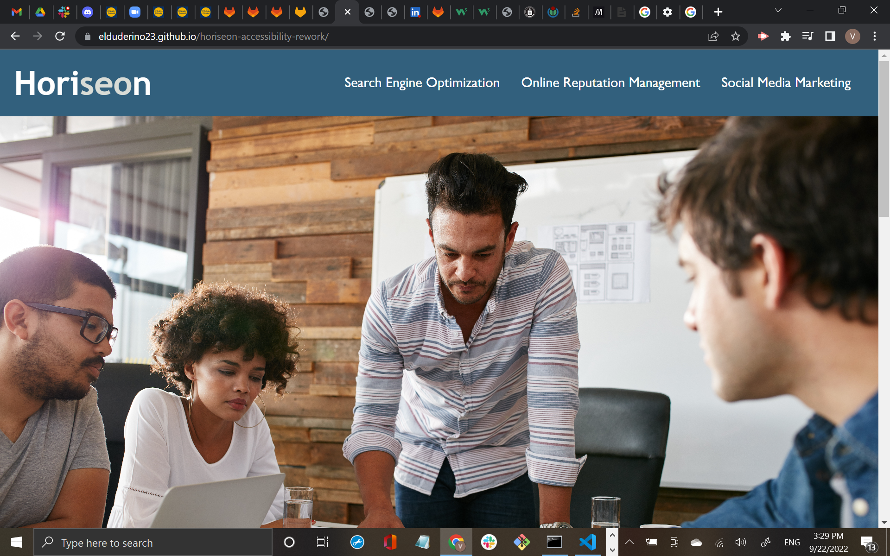

# <Horiseon-Accessibility-Rework>

## Goal

This rework is meant to make improvements to the Horiseon website internally for ease of accessibility while also keeping the eternal layout the same by:

- Updating the HTML semantics for clarity.
    - examples include switching 
 tags to <section>, <nav>, <main>, <header>, <main> to their respective parts
- Easy tracibility of updates through commits
- Clean HTML layout for easier organization
- Less cluttered CSS for easier organization

## Technology Use
-   CSS
-   HTML
-   Git Bash
-   VS Code
-   GitHub

## Execution

- Changed 
 tags to tags more appropriate tags
- Constant updates when debugging issues came up
- Trial and Error

## Result

website link: https://elduderino23.github.io/horiseon-accessibility-rework/

This website is a testimont to providing a better product while keeping the same functionality.